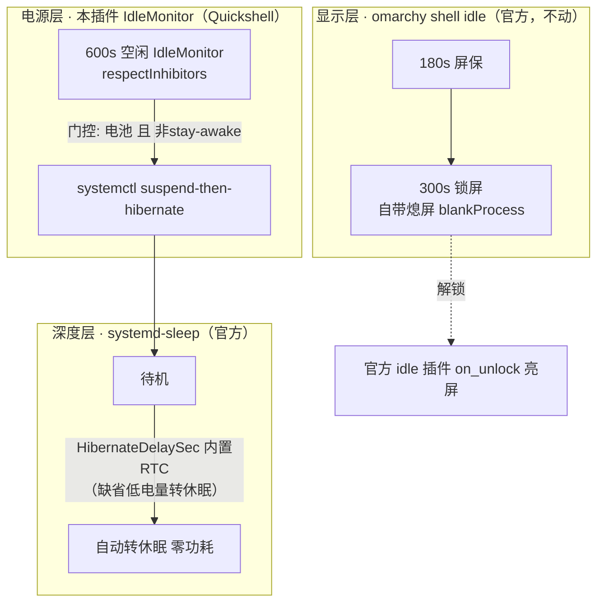

# Auto Power v2 — 重头设计

> 2026-10-08 · 基于 omarchy 官方原语 + Arch Wiki 实践 · 取代 v1.1.2

## 1. 目标（一周迭代收敛出的不变需求）

| # | 目标 | 来源 |
|---|---|---|
| G1 | 省电梯度：熄屏 → 待机(suspend) → 休眠(hibernate, 零功耗) | 全版本共识 |
| G2 | 插电只熄屏，绝不睡 | 全版本共识 |
| G3 | **绝不打扰活跃会话**（最高不变量；10-08 晚 isLocked 卡死事故即违反此条） | 事故教训 |
| G4 | stay-awake 一键抑制整条链（官方 Super+Ctrl+I / 咖啡杯） | 全版本共识 |
| G5 | 无死循环：唤醒后不会立即再睡/再休眠 | 10-08 晨事故 |
| G6 | 组件最少；每个决策只读**最权威**的状态源，绝不二手推断 | 架构原则 |

## 2. 权威状态源（设计基石）

| 问题 | 权威源 | 不该问谁 |
|---|---|---|
| 还有人用吗 | compositor 输入空闲（ext-idle-notify，Quickshell `IdleMonitor` 直读——与官方 idle 插件同源） | ~~锁屏状态~~（10-08 晚 isLocked 绑定卡死→事故）；~~idle status~~（锁后卡 false，旧脚本注释已踩坑） |
| 锁屏了吗 | ext-session-lock 协议（仅显示层关心，电源决策不需要） | 电源层根本不问 |
| 电池/插电 | `/sys/class/power_supply/*/type` + `*/online` 实时读（触发时重查，不绑定具体设备名） | — |
| 何时待机转休眠 | **systemd 内置 RTC**（`suspend-then-hibernate` + `HibernateDelaySec`，缺省=低电量时转） | ~~自制 STATE_FILE+arm-wakealarm~~（v1.1.2 为绕 hypridle 冻结缺陷而重建的轮子） |

## 3. 架构（三层，全部官方原语，插件只剩配置）

- **显示层**：`~/.config/omarchy/shell.json` idle 块（screensaver=180 / lock=300）。锁屏自带熄屏（lock Service.qml `blankProcess`：键盘+屏幕亮度 off）→ **脚本的 2s 熄屏冗余，删**。
- **电源层**：插件 `Service.qml` 内 `IdleMonitor timeout=600`（`respectInhibitors: true`，与官方 idle 插件一致），触发时经 shell 门控（stay-awake → 无电池 → 任一 AC online 均跳过）后执行 `systemctl suspend-then-hibernate`。**hypridle 整体移除**：stock Omarchy 不带 hypridle（市场 #10487/#10528 两次拒绝的 blocker，且 G6 本就要求组件最少）；ext-idle-notify 由 Quickshell 直读，权威源不变。
- **深度层**：systemd 原生。`/etc/systemd/sleep.conf.d/auto-power.conf` `HibernateDelaySec=20min` 为**可选调优**（README 有说明）；未配置时 systemd 缺省=低电量转休眠，插件无 root 依赖。

## 4. 删除清单（v1.1.2 遗产）

| 组件 | 删除理由 |
|---|---|
| `~/.local/bin/omarchy-idle-suspend` + user service | 轮询+锁状态推断 = 本周全部故障载体（idle 卡 false、isLocked 卡 true、lock_since、elapsed hack、回写竞态） |
| `STATE_FILE` auto-poweroff-at + 今晚护栏补丁 | 随脚本消亡 |
| `/etc/systemd/system/omarchy-arm-wakealarm.service` + `/usr/local/bin/omarchy-arm-wakealarm` | systemd 内置 RTC 替代 |
| hypridle 第二 listener（1800s hibernate） | suspend 期间冻结永不触发（10-08 02:28 发现），本就是死代码 |
| **hypridle 本体（受管 `~/.config/hypr/hypridle.conf` + 服务）** | v2.0.0 final：市场验证 blocker（stock Omarchy 无此包，#10528）+ G6 组件最少；`IdleMonitor` 同读 ext-idle-notify，能力不降级。加载时自动迁移：删受管配置（marker 识别）、`disable --now hypridle.service`、用户备份原样保留 |

## 5. 为什么这次不是又一轮折腾

1. 今晚事故根因（脚本信错锁状态）随脚本整体消失，不是再打一个补丁。
2. v1.1.2 双 listener 有结构性缺陷：suspend 后 30min listener 冻结不触发，只能靠自制 RTC 续命——st-h 用 systemd 原生机制消掉整个问题类。
3. v1.1.1（同一设计）当天经用户实测验证通过；10-08 夜撤回原因是过程问题（对 elapsed hack 草率的训诫），非 st-h 功能缺陷。
4. 剩余组件全部是官方原语：omarchy shell idle（屏保/锁屏）、本插件 `IdleMonitor`（待机）、systemd-sleep（休眠）。插件无脚本无状态无轮询，也不再接管任何用户配置。

## 6. 边界场景

| 场景 | 行为 | 保证 |
|---|---|---|
| 活跃使用（含锁状态卡死） | 有输入 → idle 永不满足 → 不睡 | G3 |
| 锁屏+电池 | 3min 屏保 → 5min 锁+熄屏 → 10min 待机 → +20min 休眠 | G1 |
| 锁屏+插电 | 屏保+锁+熄屏，仅此 | G2 |
| 合盖 | 锁+熄屏（lid=ignore 既有决定）→ 无输入 → 10min 待机 → 休眠 | — |
| 待机中 RTC 唤醒转休眠 | systemd 原生，唤醒即 hibernate，无用户可见闪烁窗口期 | G5 |
| 休眠恢复 | 无状态可错（无 STATE_FILE/lock_since），计时从头 | G5 |
| stay-awake | IdleMonitor `enabled=false`（+门控兜底）；官方 idle 链同受抑制 | G4 |
| 电池拔插 | 触发时实时读 `/sys/class/power_supply` | — |
| 无电池（台式机） | 门控跳过，永不自动睡 | G2 |
| 视频播放等 inhibitor | `respectInhibitors: true`，与官方 idle 一致 | — |

## 7. 迁移步骤（已完成 1-4）

1. `systemctl --user disable --now omarchy-idle-suspend.service`；脚本与 unit 移除（备份到插件 repo `legacy/`）
2. `pkexec` 撤 `/etc/systemd/system/omarchy-arm-wakealarm.service` + `/usr/local/bin/omarchy-arm-wakealarm`（备份同上）；清 RTC 残留
3. ~~插件 hypridle.conf 改单 listener（st-h）~~ → **v2.0.0 final 再进一步：删 hypridle.conf，Service.qml 内置 IdleMonitor**；sleep.conf.d/auto-power.conf 降级为可选调优
4. 删 STATE_FILE、旧护栏；版本 2.0.0，marketplace 提单
5. 验证后摘 stay-awake

## 8. 验证清单

- V1 活跃打字 15min 不睡（复现今晚事故面，auto-power 日志无触发）
- V2 锁屏+电池：600s 待机日志；`journalctl -u systemd-suspend.service` 见 suspend-then-hibernate
- V3 待机后按 `HibernateDelaySec`（或低电量）自动转休眠（RTC）；休眠恢复后**不**再自动睡
- V4 插电锁屏 30min：零睡眠动作（门控 `skip: on ac power`）
- V5 stay-awake：IdleMonitor 未武装 + 门控 `skip: stay-awake`
- V6 解锁：亮屏+主题刷新正常（官方 idle 插件职责）

## 9. 开放决策

| # | 决策 | 建议 |
|---|---|---|
| D1 | HibernateDelaySec=20min 保留？（等效旧 30min 深省电点） | 保留 |
| D2 | 「还有 Ns 待机」预警通知 | 删（通知即打扰，G3 精神） |
| D3 | 待机时机 10min 保持（旧脚本 5min-post-lock vs 现行 10min-idle） | 保持 10min（v1.1.2 已是） |
